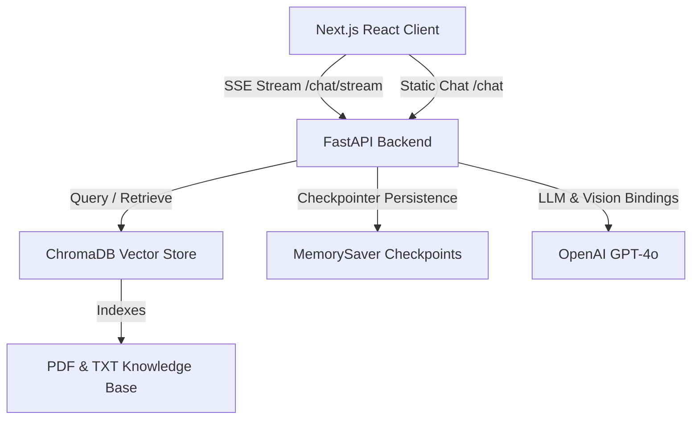

# AI Customer Support Bot (Enterprise Full-Stack RAG)

A professional, enterprise-grade AI customer support platform built with a high-performance **FastAPI** backend and a sleek **Next.js** frontend. The core support engine utilizes **LangChain** and **LangGraph** to orchestrate RAG (Retrieval-Augmented Generation) workflows, ensuring highly accurate, context-grounded, and stateful responses to customer inquiries.

---

## 🚀 System Architecture



### Core Execution Flow
1. **RAG Ingestion**: On server start, company documentation (PDFs and Text files in `data/`) are split and indexed into a local ChromaDB vector database using OpenAI's `text-embedding-3-small` model.
2. **Stateful Conversation**: LangGraph maintains the support assistant's state, orchestrating conditional routing. If a customer query demands company specifics (products, shipping, returns, technical policies), the agent invokes a retrieval tool to fetch grounded knowledge.
3. **Multi-Modal Vision**: If a customer uploads a screenshot of an error, the backend routes the base64-encoded image directly to `gpt-4o` to analyze the error visually and provide instant debugging steps.
4. **Real-time Streaming**: Model responses are streamed back to the Next.js client token-by-token using HTTP Server-Sent Events (SSE), reducing Time-to-First-Token (TTFT) and providing a premium, fluid user experience.

---

## 🛠️ Tech Stack

### Backend Service
* **API Framework**: [FastAPI](https://fastapi.tiangolo.com/) (using asynchronous endpoints & Lifespan managers)
* **Agentic Orchestration**: [LangGraph](https://github.com/langchain-ai/langgraph) (featuring `MemorySaver` thread checkpoints)
* **LLM Engine**: [LangChain OpenAI](https://github.com/langchain-ai/langchain) (integrating GPT-4o and OpenAI Embeddings)
* **Vector Database**: [ChromaDB](https://github.com/chroma-core/chroma) (local persistent storage)
* **Document Loaders**: `PyPDFLoader` and `TextLoader` via `langchain-community`

### Frontend Interface
* **Framework**: [Next.js](https://nextjs.org/) (React, TypeScript)
* **Styling**: [Tailwind CSS](https://tailwindcss.com/) & Vanilla CSS with beautiful dark-mode glassmorphic aesthetics
* **Streaming Client**: Native `fetch` with `ReadableStream` for smooth token-by-token UI rendering
* **UX/UI Highlights**: Interactive chat interface, multi-modal screenshot attachment, and an expandable **RAG Insights side panel** displaying precise document sources and text snippets.

---

## ✨ Features

* **Retrieval-Augmented Generation (RAG)**: Automatically searches and retrieves company documentation to grounding replies.
* **Server-Sent Events (SSE) Streaming**: Token-by-token text generation rendering in real-time.
* **Multi-Modal Support**: Allows customers to attach error screenshots alongside their questions.
* **Stateful Tool Calling**: Agent decides when to search the knowledge base using native LangGraph conditional edges.
* **Docker Containerization**: Multi-stage Docker configurations for both development and production deployment.

---

## ⚙️ Getting Started

### Prerequisites
* Docker & Docker Compose (Recommended)
* OR Python 3.9+ & Node.js 18+
* OpenAI API Key (configured in your `.env` file)

---

### Method A: Running with Docker Compose (Quickest)

1. Clone the repository:
   ```bash
   git clone https://github.com/Yashborse4/ai-customer-support-bot.git
   cd ai-customer-support-bot
   ```

2. Configure environment variables:
   Create a `.env` file in the root directory:
   ```env
   OPENAI_API_KEY=sk-proj-...
   PERSIST_DIRECTORY=./chroma_db
   COLLECTION_NAME=customer_support_kb
   MODEL_NAME=gpt-4o
   EMBEDDING_MODEL=text-embedding-3-small
   NEXT_PUBLIC_API_URL=http://localhost:8000
   ```

3. Launch the complete application:
   ```bash
   docker compose up --build
   ```
   * Next.js Frontend: `http://localhost:3000`
   * FastAPI Backend: `http://localhost:8000`
   * FastAPI Swagger Docs: `http://localhost:8000/docs`

---

### Method B: Manual Local Setup

#### 1. Start the FastAPI Backend
1. Create a Python virtual environment and install packages:
   ```bash
   python -m venv .venv
   source .venv/bin/activate  # On Windows: .venv\Scripts\activate
   pip install -r requirements.txt
   ```

2. Make sure your `.env` file exists with your `OPENAI_API_KEY`.

3. Place company documentation (e.g., PDFs, TXT files) inside the `data/` directory.

4. Run the API server:
   ```bash
   uvicorn src.api.main:app --host 0.0.0.0 --port 8000 --reload
   ```

#### 2. Start the Next.js Frontend
1. Open a new terminal in the `frontend` folder:
   ```bash
   cd frontend
   npm install
   ```

2. Start the Next.js local development server:
   ```bash
   npm run dev
   ```
   Open `http://localhost:3000` in your browser.

---

## 🧪 Testing

The codebase includes an extensive unit and integration test suite (fully typed, leveraging `pytest` and `fastapi.testclient`):

To run tests:
```bash
python -m pytest
```

---

## 📈 Project Roadmap

- [x] Complete Multi-modal query integration (Vision analysis for error screenshots).
- [x] Robust PDF and Text indexing system.
- [x] State-of-the-art token streaming architecture (SSE) for low Time-to-First-Token (TTFT).
- [x] Premium Next.js interactive frontend with RAG insights.
- [ ] Integration with Slack and Discord channels.
- [ ] Advanced analytics and administrator dashboard for human support operators.

---
Built with ❤️ by [Yash Borse](https://github.com/Yashborse4)
